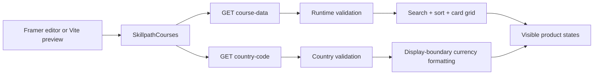

# Skillpath

### A live learning catalogue for WebVeda — resilient data, clear product states, and motion with purpose.

<p align="center">
  <a href="https://only-collection-516444.framer.app/"><strong>Published Framer page</strong></a> ·
  <a href="https://skillpath-framer-assessment.vercel.app/"><strong>Vercel preview</strong></a> ·
  <a href="https://github.com/AyushCoder9/skillpath-framer-assessment"><strong>Source code</strong></a> ·
  <a href="https://www.framer.com/">Framer</a>
</p>

<p align="center">
  
  
  
  
  
</p>

<p align="center">
  <a href="https://only-collection-516444.framer.app/"></a>
</p>


> **WebVeda technical assessment · Junior Developer**
> Skillpath is a production-shaped Framer catalogue component and standalone preview built around a simple idea: **reliability should be visible in the product, not hidden in the implementation.**

---

## Why this submission is different

The happy path is easy to style. The product becomes trustworthy at the edges.

Skillpath treats the catalogue as a live instrument rather than a static card grid:

| Product decision | What the user experiences |
| --- | --- |
| **Independent data sources** | Course content stays usable even when regional pricing is unavailable. |
| **Honest currency boundary** | Paise and USD cents are converted only when displayed; the active region stays visible. |
| **Failure is a designed state** | Loading, empty, no-match, offline, retrying, and partial-failure states are all intentional surfaces. |
| **Motion carries meaning** | Entrance, layout, price, status, and hover transitions explain change instead of decorating it. |
| **Live data, not mock cards** | The catalogue is requested from the supplied assignment API at runtime. |
| **Portable component surface** | The main catalogue can be placed in Framer with two property controls and no Vite-only APIs. |

## Product surface

- **Live catalogue hero** with an animated orbital index and a clear “system live” signal.
- **Course discovery** through search across course name, description, category, short-course label, and course type.
- **Featured and price sorting** that respects the active regional currency.
- **Responsive course grid** that adapts from desktop to tablet to mobile.
- **Refundable badges** controlled by a Framer property control.
- **Regional price status** that never guesses when the country endpoint fails.
- **Accessible interaction states** with labels, visible focus rings, live regions, alert/status semantics, keyboard-friendly controls, and reduced-motion support.

## Architecture at a glance



### Data contracts

The component requests the assignment API with `GET` and validates both responses before rendering them:

```text
https://syncsphere-hiv6.onrender.com/assignment/course-data
https://syncsphere-hiv6.onrender.com/assignment/country-code
```

Course records are expected to include the course identity and copy, both regional price units, category/type metadata, and the refundable flag. The country response is accepted only for the supported `IN` or `US` values.

Prices remain in their source units until the display boundary:

```text
India:  pricePaise   / 100 → INR
United States: priceUsdCents / 100 → USD
```

If the catalogue request fails, the component exposes a retryable offline state. If only the regional request fails, course cards remain visible and display **Price unavailable** rather than inventing a locale or stale value.

## Motion system

Motion is deliberately constrained to Framer primitives:

- `motion` for entrance, hover, tap, and layout transitions.
- `AnimatePresence` for state changes and regional price transitions.
- `useScroll`, `useSpring`, and `useTransform` for the hero orbit/parallax layer.
- `MotionConfig reducedMotion="user"` and `useReducedMotion` for accessibility.
- CSS shimmer for loading skeletons; no external animation runtime.

There is no GSAP, Lottie, Three.js, external UI kit, copied template, custom animation engine, or hidden mock-data layer.

## Repository map

```text
.
├── index.html                 # Standalone preview shell and metadata
├── src/
│   ├── SkillpathCourses.tsx   # Portable Framer component + data/state logic
│   ├── preview.tsx            # Full-page assessment presentation
│   ├── skillpath.css          # Scoped component and preview styling
│   ├── framer-stub.ts         # Local Vite alias for Framer editor APIs
│   ├── framer.d.ts            # Minimal Framer typing surface for the preview
│   └── vite-env.d.ts          # Vite client types
├── SUBMISSION_NOTE.md         # Short assessment handoff note
├── package.json               # Scripts and runtime dependencies
├── package-lock.json          # Reproducible dependency resolution
└── vite.config.ts             # Preview alias/configuration
```

## Run locally

```bash
git clone https://github.com/AyushCoder9/skillpath-framer-assessment.git
cd skillpath-framer-assessment
npm install
npm run dev
```

For a production build:

```bash
npm run build
npm run preview
```

`npm run build` runs TypeScript checking before Vite creates the `dist/` output.

## Framer handoff

The code-component entry point is [`src/SkillpathCourses.tsx`](./src/SkillpathCourses.tsx). It is annotated for:

```text
@framerSupportedLayoutWidth any
@framerSupportedLayoutHeight auto
```

Available Framer property controls:

1. **Accent** — changes the catalogue accent color.
2. **Refundable badge** — toggles refundable labels on course cards.

The component accepts a forwarded `style` prop, keeps its CSS variables scoped to `.skillpath-courses`, and avoids preview-only runtime APIs so the component surface remains portable.

## Assessment handoff

This repository includes the complete set of links and artifacts requested by the WebVeda assignment:

1. **Published Framer page:** [only-collection-516444.framer.app](https://only-collection-516444.framer.app/)
2. **Public code:** [github.com/AyushCoder9/skillpath-framer-assessment](https://github.com/AyushCoder9/skillpath-framer-assessment)
3. **Short assessment note:** [`SUBMISSION_NOTE.md`](./SUBMISSION_NOTE.md) — kept under the requested 200-word limit.
4. **AI disclosure:** the note records that AI helped draft the initial fetch/component structure and that the response validation, failure handling, currency logic, cancellation, accessibility, responsive behavior, and motion were reviewed and rewritten.
5. **Vercel preview:** [skillpath-framer-assessment.vercel.app](https://skillpath-framer-assessment.vercel.app/) — a standalone preview of the same component and interaction model.

The published Framer page is the primary handoff link. The Vercel URL is included as a development/standalone preview; it is not a replacement for the requested Framer publication.

## Verification checklist

- [x] TypeScript checked as part of the production build.
- [x] Course and country requests are independent and cancellable with `AbortController`.
- [x] Malformed or unsuccessful responses produce explicit error states.
- [x] Empty catalogue and zero search matches have separate states.
- [x] Regional pricing never falls back to a guessed currency.
- [x] Search and sorting operate on the loaded catalogue.
- [x] Responsive desktop/tablet/mobile layouts are included.
- [x] Reduced-motion behavior is supported.
- [x] Framer property controls and layout annotations are included.
- [x] Submission note documents trade-offs and follow-up opportunities.

## Links

| Resource | URL |
| --- | --- |
| **Published Framer page** | [only-collection-516444.framer.app](https://only-collection-516444.framer.app/) |
| **Vercel standalone preview** | [skillpath-framer-assessment.vercel.app](https://skillpath-framer-assessment.vercel.app/) |
| **GitHub repository** | [github.com/AyushCoder9/skillpath-framer-assessment](https://github.com/AyushCoder9/skillpath-framer-assessment) |
| **Portfolio** | [ayushkumarsingh-six.vercel.app](https://ayushkumarsingh-six.vercel.app/) |
| **LinkedIn** | [Ayush Kumar Singh](https://www.linkedin.com/in/ayush-kumar-singh-910379320/) |
| **GitHub profile** | [AyushCoder9](https://github.com/AyushCoder9) |

## About the author

**Ayush Kumar Singh** — Full-stack and AI/ML developer building production-shaped systems across React, TypeScript, Python, FastAPI, data platforms, testing, and applied LLM workflows.

Currently pursuing a **B.Tech in Computer Science (AI & ML)** at Newton School of Technology (ADYPU), Pune (**2024–2028 · GPA 9.26/10.00**). I enjoy turning ambiguous product requirements into reliable, thoughtful interfaces and systems, especially where frontend behavior, backend correctness, and user trust meet.

## License

This repository was created for the WebVeda technical assessment. The source is shared for review and demonstration; please do not present it as your own assessment submission.
